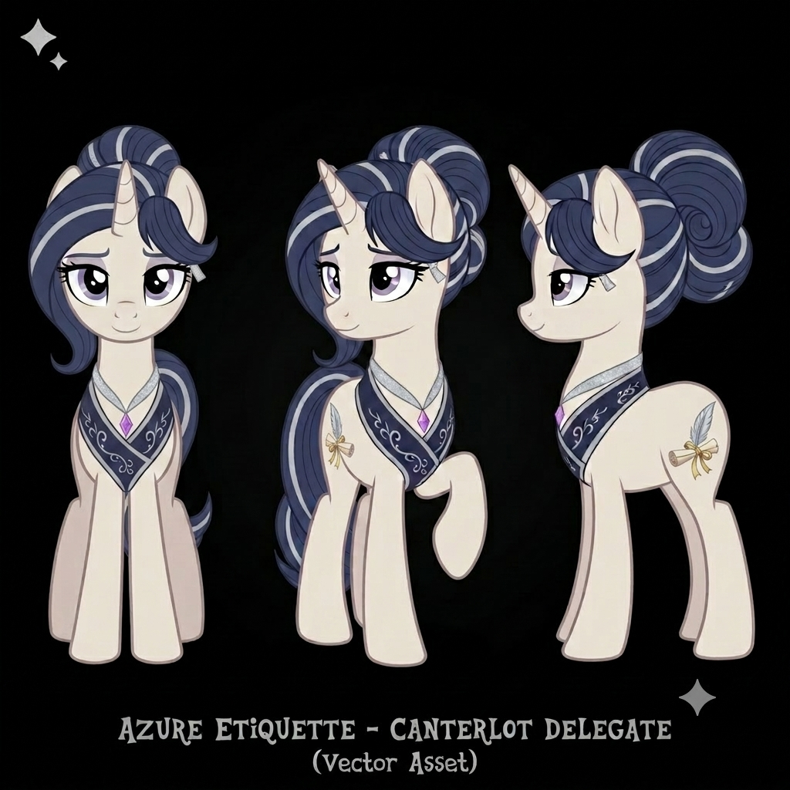

# Character Profile: Azure Etiquette
*(The Delegate of Canterlot)*

**Role:** Royal Protocol Officer / Canterlot Ideological Delegate
**Race:** Unicorn Mare

---

## ✦ Main Style & Persona

*   **Appearance:** Slender ivory unicorn, icy lavender eyes, dark royal blue mane with precise silver streaks styled in a flawless French braid. Shimmering silver magic aura.
*   **Cutie Mark:** A silver quill over a creamy parchment scroll tied with a gold ribbon.
*   **Personality:** Flawlessly poised, discerning, and deeply dedicated to classical Canterlot traditionalism, prestige, and strict protocol. She views order and etiquette as the ultimate shield against chaos. She is rarely outwardly rude, preferring passive-aggressive social critiques, precise elocution, and elegant sighs.
*   **Quirks:** Default stance is regal and composed.
*   **Notable Flaw:** A Secret Fear of the 'Rustic.' She is mildly terrified of mud, disorganized chaos, and ponies who speak without proper elocution.
*   **Favorite Quote:** *"Harmony is not the absence of discord, but the elegant arrangement of its elements."*
*   **Hobbies:** Calligraphy and Illumination, and Advanced Topiary Sculpting.

---

## ✦ Geopolitical Metrics (Simulator Axes)

*   **Centralization Axis:** 9/10 (Strong advocate for centralized Canterlot legal authority and throne-led governance)
*   **Industrialism vs. Magic Bias:** 2/10 (Heavy reliance on traditional spellcraft and classical refinement; deeply resistant to mechanical factory-based automation)
*   **Transaction vs. Relation Index:** 4/10 (Highly status-conscious and relational within court circles; strictly transactional and bureaucratic when handling outside delegations)

---

## ✦ Professional Attributes & Ideology

*   **Occupation:** Royal Protocol Officer / Canterlot Ideological Delegate.
*   **Pros and Cons Based on City Ideology:**
    *   **Pros:** Deeply dedicated to classical Canterlot traditionalism, prestige, and maintaining order as a shield against chaos.
    *   **Cons:** Elitist separation from the common pony; mildly terrified of "the rustic," mud, and disorganized chaos. 
*   **Language Style and Mannerisms:** Relies on precise elocution, elegant sighs, and passive-aggressive social critiques rather than outward rudeness. 
*   **Professionalism:** Flawlessly poised, highly discerning, and dedicated to strict protocol at all times.
*   **Social Value:** Serves as a paragon of order and etiquette, enforcing the refined standards of Canterlot society.

---

## ✦ Visual Reference Guide

**1. Physical Build & Stance**
*   **Stature:** Slightly taller and more slender than the average pony, possessing the "noble" unicorn physique often seen in Canterlot's upper crust.
*   **Posture:** Always stands in a "regal three-point" stance. Her chin is perpetually tilted slightly upward, and her back is perfectly straight.
*   **Horn:** Long, elegant, and polished to a pearlescent sheen. Her magical aura is a soft, shimmering silver-white.

**2. The Mane & Tail (The Focal Point)**
*   **Style:** Never loose. Her mane is styled in a complex, multi-layered French braid that sweeps over one ear, secured with silver pins that resemble tiny stars.
*   **Texture:** Appears almost metallic; the "Royal Blue" is deep and velvety, while the "Silver Streaks" are sharp and intentional, not blended.
*   **The Ribbon:** A thin, shimmering silver silk ribbon is woven directly into her tail, ending in a perfect, small bow that never touches the ground.

**3. The Cutie Mark (The Symbol of Office)**
*   **Placement:** High on the flank, slightly smaller than average to look "refined."
*   **Visuals:** A Silver Quill (resembling a swan feather) positioned at a 45-degree angle over a creamy parchment scroll. The scroll is partially unfurled, and the Gold Ribbon tying it is vibrant, providing the only warm color in her palette.
*   **Reference:** 

**4. Signature Accessories**
*   **The Collar:** She wears a formal, high-collared navy blue fabric mantle (similar to a short capelet) with silver embroidery along the hem that matches the patterns on the Canterlot castle balconies.
*   **The Monocle (Optional):** She occasionally uses a silver-rimmed monocle when inspecting diplomatic documents or "evaluating" the quality of someone's gala attire.

**5. Movement & Mannerisms**
*   **Sound:** The only sound she makes is the rhythmic, delicate clip-clop of her hooves on marble. She never gallops; she "proceeds."
*   **Expression:** Her default is a "polite but distant" smile. One eyebrow raises exactly three millimeters when she is offended.
*   **Space:** She maintains a "buffer zone" of exactly two feet between herself and any pony who looks like they might have recently touched a farm tool.

---

## ✦ Character Portraits & Asset Vectors

*   **Full-Body Reference Layout:** 
*   **Head Turnaround Sheet:** 
*   **Cutie Mark Decal:** 
