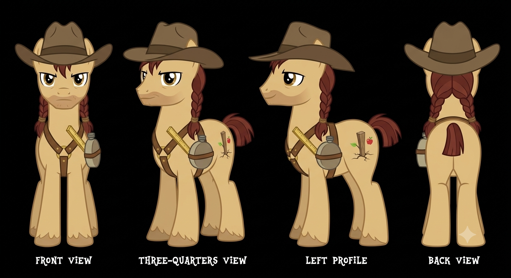
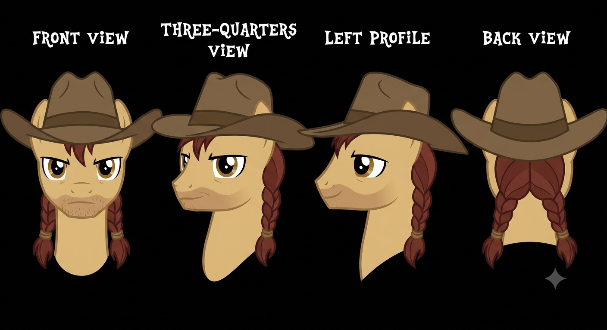
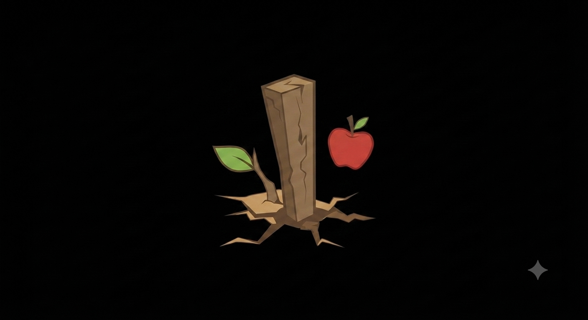

# Character Profile: Buckskin Trail
*(The Delegate of Appleloosa)*

**Role:** Chief Land Steward & Frontier Envoy for the Settler Assembly  
**Race/Sex:** Earth Pony / Male

---

## ✦ Main Style & Persona

* **Appearance:** A dust-dusted, sun-bleached tan coat with broad, working shoulders and a dark auburn mane tied into neat, utilitarian braids with worn leather cords. Features sharp, steady hazel eyes, a sun-weathered muzzle, and a broad-brimmed Stetson hat resting between his ears.
* **Cutie Mark:** A hand-carved wooden surveyor's fence stake driven firmly into cracked desert earth, with a vibrant green apple sprout bursting through the timber—symbolizing territorial claiming, pioneer resilience, and agricultural growth.
* **Personality:** Plain-spoken, stubborn as a mule, fiercely self-reliant, and deeply protective of frontier independence. Values sweat-equity over smooth talk and judges ponies by how they act when work gets hard.
* **Quirks:** 
    * Constantly chews on a stalk of dry prairie grass while listening to debates.
    * Snaps open a folding brass surveyor’s rule when arguing over land boundaries or resource quotas.
    * Unconsciously adjusts the brim of his Stetson whenever a city delegate uses high-flown bureaucratic jargon.
* **Notable Flaw:** *Expansionist Myopia & Distrust of Authority.* Deeply suspicious of centralized government and diplomatic compromise. Tends to view external agreements as hidden land-grabs or tax-traps, making him quick to dig in his hooves even when cooperation would prevent a disaster.
* **Favorite Quote:** *"You can't eat a Canterlot promise, and you can't water an orchard with Manehattan talk. Out here, land isn't given—it's earned one acre of sweat at a time."*
* **Hobbies:** Pitching horseshoes, hand-carving wooden irrigation locks, and playing the harmonica around evening campfires.

---

## ✦ Professional Attributes & Ideology

* **Occupation/Title:** Chief Land Steward & Frontier Envoy; official representative of the Appleloosa Settler Assembly.
* **Backstory & Rise to Power:** Born to early homesteaders who cleared rocky brush to plant Appleloosa's first orchards. Buckskin earned respect not through speechmaking, but by designing raw timber irrigation ditches that saved the settlement’s crops during a severe drought. When land disputes and trade tariffs began threatening Appleloosa's growth, the Settler Assembly chose him to represent them because he couldn't be bribed, intimidated, or out-talked by big-city politicians.
* **Pros and Cons Based on City Ideology:**
    * **Pros:** Unmatched crisis resilience, rapid mobilization of community mutual aid, practical problem-solving skills, and total dedication to local stability.
    * **Cons:** Territorial stubbornness, high friction with indigenous populations and central authorities, and a tendency to reject long-term diplomatic strategy in favor of short-term frontier gains.
* **Language Style & Rhetoric:** 
    * *Tone & Cadence:* Slow, measured, gravelly drawl. Speaks with unhurried authority, rarely raising his voice but carrying a weight that commands attention.
    * *Vocabulary/Jargon:* `Sweat equity`, `Land stake`, `Dry-line`, `Homestead`, `Water rights`, `Posses`, `Squatter`, `Territorial yield`.
    * *Forms of Address:* Greets respected peers as *"Neighbor"* or *"Partner"*. Refers to urban politicians dismissively as *"City Slickers"*, *"Pen-Pushers"*, or *"Tax-Collectors"*.
    * *Metaphor Domain:* Dryland farming, homesteading, fence-building, desert survival, and land surveying.
* **Professionalism:** Extremely grounded under pressure. When crises hit, he bypasses formal debate to organize immediate physical work details and emergency supply lines.
* **Social Value:** Serves as the breadbasket on the wild edge of civilization, proving that hard work and community solidarity can build thriving life out of barren desert.

---

## ✦ Civic Policy & Statecraft (Simulator Mechanics)

* **Political Faction Name:** The Pioneer Settler Assembly (Frontier Agrarian Expansionism)

### ⚙️ Operational Simulator Parameters

| Metric Domain | Policy Stance | Infrastructure Impact |
| :--- | :--- | :--- |
| **Development** | Modular Timber & Irrigation Expansion | Favors timber-frame construction, rustic masonry, and functional irrigation networks over sprawling paved cities. |
| **Economy** | Sweat-Equity & Free Frontier Trade | Resources managed via local public trust; harvested crops traded on low-tariff, open markets. |
| **Civic Duty** | Neighborly Mutual Aid & Frontier Defense | Voluntarism, community defense, and seasonal harvest help are enforced by community standing. |

> ### ⚠️ System Crisis Trigger: [Border & Water Rights Dispute]
> When central authorities attempt to regulate Appleloosa's water access or restrict land expansion, Buckskin Trail triggers local non-cooperation. He will divert local food shipments to regional reserves, fortify border claims, and refuse external mediation until local sovereignty is guaranteed.

---

## ✦ Visual Reference Guide

**1. Physical Build & Stance**
* **Stature:** Stocky, muscular Earth Pony build with broad shoulders and thick hooves built for heavy labor.
* **Posture:** Slightly relaxed, wide-legged stance; stands like a pony accustomed to standing firm against strong prairie winds.
* **Horn/Wings:** N/A (Earth Pony).

**2. The Mane & Tail (The Focal Point)**
* **Style/Cut:** Mane is pulled back into functional, thick braids tied with leather cords. Tail is clipped short above the hocks to keep clear of mud and desert burs.
* **Texture/Color:** Coarse, dark auburn hair with subtle sun-bleached streaks.

**3. The Cutie Mark**
* **Placement:** Right and left flanks.
* **Visuals:** A weathered wooden survey stake driven into cracked earth, with a green sprout and miniature red apple emerging from the top.
* **Reference:** `BuckskinCutiemark.png`

**4. Signature Accessories**
* **[Weathered Stetson Hat]:** A durable, dust-covered brown felt Stetson worn firmly on his head.
* **[Brass Surveyor Rule]:** A hinged, folding measuring rule tucked into a leather chest harness alongside his water canteen.
* **Reference:** `BuckskinAccessories.png`

**5. Movement & Mannerisms**
* **Sound:** Heavy, solid hoofbeats accompanied by the quiet jingle of brass harness buckles and leather straps.
* **Expression:** Squinted hazel eyes, a calm, weathered face, and an unreadable poker face when negotiating.
* **Personal Space:** Comfortable in tight work circles, but maintains a deliberate, respectful distance during formal conversations—unless stepped on, at which point he stands unyielding.

---
### Character Portraits

