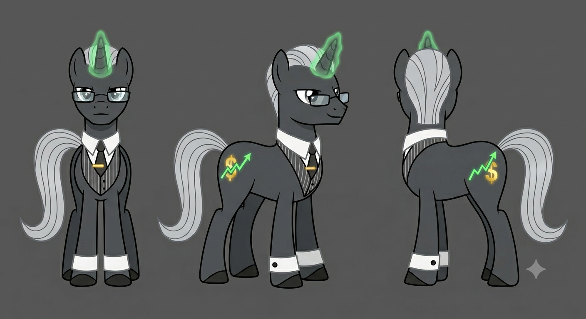

# Character Profile: Ticker Tape
*(The Delegate of Manehattan)*

**Role:** Chief Liquidity Architect & Head Corporate Liaison for the Manehattan Conglomerate Council  
**Race/Sex:** Unicorn / Male

---

## ✦ Main Style & Persona

* **Appearance:** A sleek, razor-thin charcoal-gray unicorn with an impeccably groomed, slicked-back silver mane. Wears a tailored, pinstriped collar-and-cuff set with a gold tie-clip, and sharp, rectangular reading glasses perched on his snout. His horn radiates a bright, piercing neon-green magical aura reminiscent of a digital ledger screen.
* **Cutie Mark:** A stylized, upward-trending neon-green line graph interwoven with a glowing gold dollar sign ($), representing his talent for market trends and rapid financial growth.
* **Personality:** Hyper-analytical, a brilliant mathematical strategist, incredibly persuasive in economic negotiations, and completely unflappable when market crashes occur.
* **Quirks:** 
    * Speaks with an extremely fast, high-velocity cadence that leaves other ponies dizzy.
    * When stressed or calculating a deal, his hoof constantly taps a rhythmic, erratic pattern on the floor—a habit left over from listening to rapid telegraph ticker-tape machines.
* **Notable Flaw:** *Cutthroat Transactionalism.* Intensely paranoid about losing his competitive edge and treats friendships strictly as networking opportunities. Calculates the literal monetary value of everything and everyone, leading to deep personal isolation.
* **Favorite Quote:** *"The early pegasus catches the updraft, but the smart unicorn buys the wind rights. Everything has a price, partner; success is just a matter of knowing the overhead."*
* **Hobbies:**
    * **High-Stakes Speed Chess:** Plays hyper-accelerated speed chess against elite players in Manehattan's parks to keep his tactical mind sharp.
    * **Urban Rooftop Gardening:** Maintains a private, high-tech hydroponic greenhouse on his penthouse roof where he breeds rare exotic orchids using automated timers—the one place where he can watch an investment grow without external interference.

---

## ✦ Professional Attributes & Ideology

* **Occupation/Title:** Chief Liquidity Architect & Head Corporate Liaison for the Manehattan Conglomerate Council; former Floor Runner and Junior Equity Analyst at the Stock Exchange.
* **Pros and Cons Based on City Ideology:**
    * **Pros:** Exceptional capacity for financial leverage, rapid risk assessment, unmatched negotiation tactics, and high-velocity capital deployment.
    * **Cons:** Ruthless willingness to short-sell failing allies, severe blind spot regarding non-monetary value or moral goodwill, and high exposure to social market crashes.
* **Language Style & Rhetoric:**
    * *Tone & Cadence:* Extremely fast-paced, high-velocity, and smooth. Speaks with the rhythmic urgency of a trading floor, projecting absolute confidence.
    * *Vocabulary/Jargon:* `Leverage`, `Return on Investment (ROI)`, `Liquidity`, `Liabilities`, `Risk Assessment`, `Market Cap`, `Optimization`, `Overhead`.
    * *Forms of Address:* Greets others by formal corporate standings (e.g., *Delegate Gauge*). Refers to respected hustlers as *Partner* or *Asset*, and dismisses unhelpful parties as *Liability* or *Sub-prime*.
    * *Metaphor Domain:* High finance, corporate equity, stock market trends, and maritime shipping logistics.
* **Professionalism:** Unflappable under extreme economic strain. Views crises not as emotional panics, but as high-yield restructuring opportunities.
* **Social Value:** Maximizes revenue streams, secures trade monopolies, and ensures maximum macroeconomic growth for Manehattan.

---

## ✦ Civic Policy & Statecraft (Simulator Mechanics)

* **Political Faction Name:** The Manehattan Conglomerate Council (Hyper-Capitalist Merchant-Republic & Corporate Meritocracy)

### ⚙️ Operational Simulator Parameters

| Metric Domain | Policy Stance | Infrastructure Impact |
| :--- | :--- | :--- |
| **Development** | Corporate Infrastructure Expansion | Prioritizes skyscraper construction, deep-water port logistics, and commercial trade hubs over public welfare zoning. |
| **Economy** | Deregulated Venture Capitalism | Driven by speculation, venture capital, and aggressive trade tariffs designed to maximize capital accumulation. |
| **Civic Duty** | Productivity & Market Mobility | Social status and political representation are earned through wealth, property ownership, and direct economic output. |

> ### ⚠️ System Crisis Trigger: [Market Liquidation / Insolvency Spike]
> When an ally's economic throughput drops below target ROI or trade routes stall, Ticker Tape initiates aggressive capital restructuring. He will short-sell failing bilateral agreements, issue margin calls, and reallocate shared capital exclusively to high-yield assets, creating severe political and economic strain across allied factions.

---

## ✦ Visual Reference Guide

**1. Physical Build & Stance**
* **Stature:** Sleek, thin, and agile build, favoring poise and executive authority over physical strength.
* **Posture:** Sharp, upright posture; stands with calculated composure, ready to command a floor.
* **Horn/Wings:** Unicorn horn with sharp tip and neon-green magic glow.

**2. The Mane & Tail (The Focal Point)**
* **Style/Cut:** Impeccably groomed, slicked-back silver mane and a smooth, flowing silver tail.
* **Texture/Color:** High-shine, metallic silver with smooth directional comb lines.

**3. The Cutie Mark**
* **Placement:** Right and left flanks.
* **Visuals:** Stylized neon-green upward trend graph interwoven with a glowing gold dollar sign ($).
* **Reference:** `TickerCutiemark.png`

**4. Signature Accessories**
* **[Pinstriped Attire]:** Tailored charcoal pinstripe collar and cuffs with a solid dark tie and gold tie-clip.
* **[Optical Specs]:** Rectangular gold-rimmed reading glasses perched cleanly on his snout.
* **Reference:** `TicketHeadVector.png`

**5. Movement & Mannerisms**
* **Sound:** Rapid, rhythmic hoof taps mimicking telegraph ticker-tape machines.
* **Expression:** Sharp, evaluating eyes, subtle knowing smirk, and laser-focused gaze.
* **Personal Space:** Projects an assertive, close-range presence during deals, closing distance to exert psychological dominance.

---
### Character Portraits

