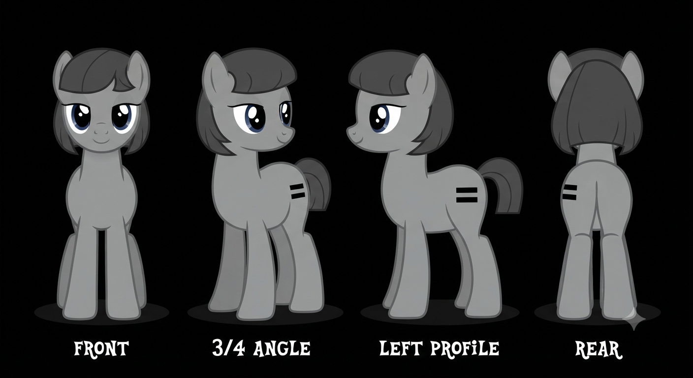
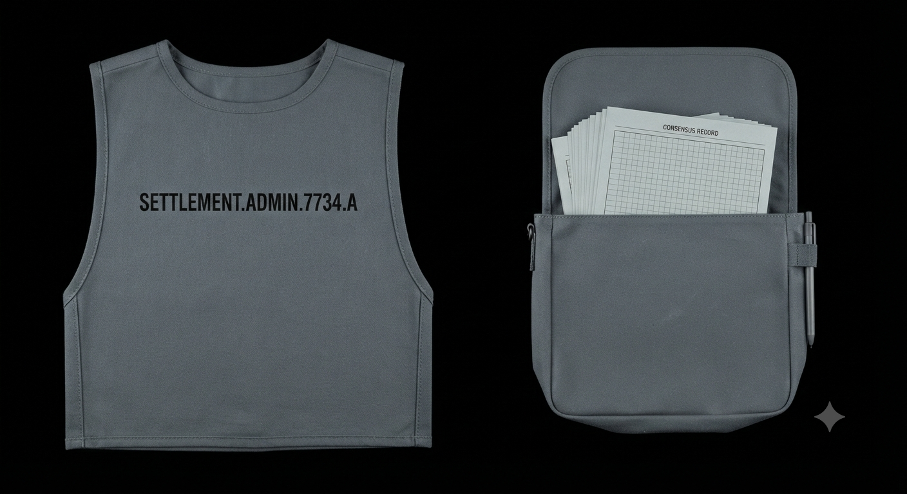
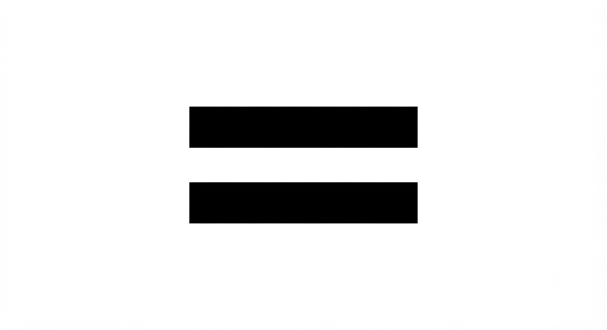

# Character Profile: Parity
    *(The Delegate of The Equality Settlement)*

    **Role:** Chief Spokespony and Archivist of Consensus
    **Race/Sex:** Earth Pony / Non-Binary

    ---

    ## ✦ Main Style & Persona

    * **Appearance:** A flat, non-reflective "Slate Grey" coat with a rigid, utilitarian buzz-cut mane and tail Possesses a sterile, unremarkable build designed to blend into the town’s architecture.
    * **Cutie Mark:** The standard "Equal Sign" brand, which they treat with religious reverence, having scrubbed away their original mark years ago
    * **Personality:** Possesses a "We" mentality; avoids the use of "I" to discourage ego. Hyper-analytical, weaponizedly calm, and speaks in a measured, monotone cadence.
    * **Quirks:** 
        * Constantly taps hooves in a rhythmic, 4/4 time signature to maintain social "balance."
        * Will gently guide conversations back to "consensus" whenever a topic veers into personal opinion
        * Avoids prolonged eye contact with those who display signs of "unbalanced" ambition
    * **Notable Flaw:** *Institutional Hypocrisy & Blind Ego.* Believes they have no ego while maintaining a position of high authority. Blind to the fact that their administrative skill is, in itself, a talent.
    * **Favorite Quote:** *"The sum is only as strong as the silence between the variables."
    * **Hobbies:** Organizing archives for redundant efficiency, auditing town noise levels, and practicing monotone recitation.

    ---

    ## ✦ Professional Attributes & Ideology

    * **Occupation/Title:** Chief Spokespony and Archivist of Consensus; responsible for resolving "social friction" and ensuring all public discourse adheres to Equalist philosophy.
    * **Pros and Cons Based on City Ideology:**
        * **Pros:** Exceptional efficiency in conflict resolution, absolute loyalty to the state, and high capacity for administrative processing.
        * **Cons:** Inability to innovate, extreme stubbornness regarding policy, and a refusal to acknowledge the utility of specialized talents.
    * **Language Style & Rhetoric:**
        * *Tone & Cadence:* Extremely formal, bureaucratic, and completely flat. Lacks inflection, sounding akin to a reading machine.
        * *Vocabulary/Jargon:* `We`, `Our`, `The Community`, `Consensus`, `Variable`, `Social Friction`, `Peer Auditing'.
        * *Forms of Address:* Strictly avoids personal titles or singular honorifics; refers to others collectively as *"The Community"* or via standardized roles like *"Citizen".
        * *Metaphor Domain:* Mathematical equilibrium, archival redundancy, structural uniformity, noise cancellation, and data homogenization.
    * **Professionalism:** Maintains total composure during crises. Views panic as an "unauthorized variable" that must be neutralized through logic.
    * **Social Value:** Acts as the primary interface between the administration and the citizenry, ensuring the "status quo" is maintained through psychological persuasion rather than brute force.

    ---

    ## ✦ Civic Policy & Statecraft (Simulator Mechanics)
    ### ⚙️ Operational Simulator Parameters

    | Metric Domain | Policy Stance | Infrastructure Impact |
    | :--- | :--- | :--- |
    | **Development** | Brutalist Uniform Architecture | Mandates housing that is completely identical to prevent envy and maximize baseline space efficiency. |
    | **Economy** | Centralized Resource Pool | Favors a strict resource-sharing model where all output goes to a central pool, then is distributed evenly regardless of individual input. |
    | **Civic Duty** | Monitored Thought Transparency | Expects total transparency from citizens regarding their thoughts; actively encourages "peer auditing" to ensure no one is harboring secret talents. |

    > ### ⚠️ System Crisis Trigger: [Consensus Fracture]
    > When individual ambition or specialized talents threaten the baseline equilibrium of the community, Parity initiates a total ideological audit. They will freeze all resource distribution from the central pool, implement mandatory monotone recitations, and deploy peer-auditing squads to eliminate social friction and restore uniform status quo.

    ---

    ## ✦ Visual Reference Guide

    **1. Physical Build & Stance**
    * **Stature:** Average height, lean and athletic but unmuscled, favoring efficiency over power.
    * **Posture:** Perfectly straight, never slouching; often stands with hooves shoulder-width apart to appear stable and immovable.
    * **Horn/Wings:** N/A (Earth Pony).

    **2. The Mane & Tail (The Focal Point)**
    * **Style/Cut:** Buzz-cut, zero length, uniform rigid styling.
    * **Texture/Color:** Coarse and matte; no shine, no style, matching the flat slate-grey coat.

    **3. The Cutie Mark**
    * **Placement:** Right flank.
    * **Visuals:** A standard, stark black equal sign (=) burned into the coat.
    * **Reference:** `ParityCutiemark.png`
    * **Reference:** `ParityAccesory.png`

    **4. Signature Accessories**
    * **[Identification Tabard]:** A heavy-duty, slate-grey tabard worn over the chest, marked with "SETTLEMENT.ADMIN.7734.A".
    * **[Grey Utility Satchel]:** A simple, matte-finished bag containing consensus forms and official documentation.

    **5. Movement & Mannerisms**
    * **Sound:** Soft, rhythmic hoofbeats that never accelerate, regardless of urgency.
    * **Expression:** Neutral, placid, and completely unreadable.
    * **Personal Space:** Maintains a rigid 3-foot buffer from others to prevent "emotional contagion".

    ---
    ### Character Portraits
    
    
    
    
